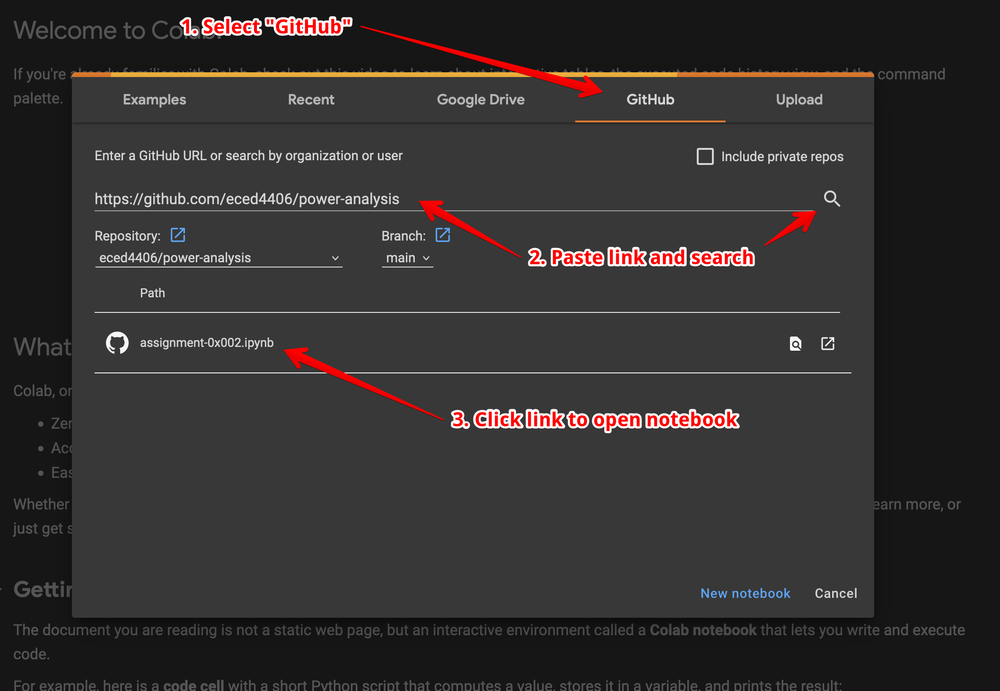
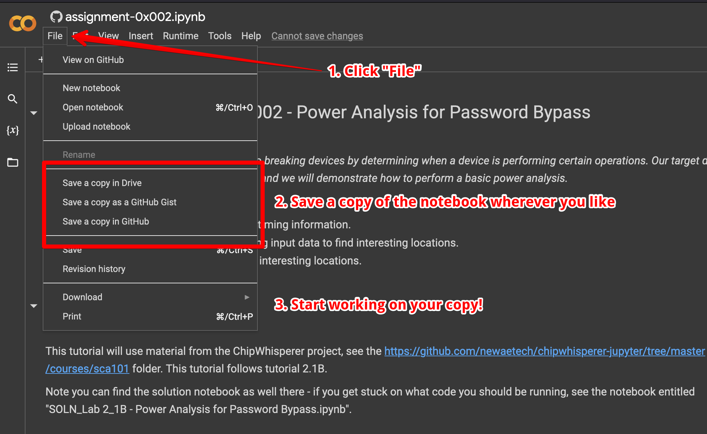

# 0x002 - Power Analysis

For Assignment 0x002, you'll apply power analysis to a program that validates a password.

## Jupyter

The procedure for this assingment is defined in a Jupyter notebook (available [here](https://github.com/eced4406/power-analysis)).
Jupyter notebooks are interactive environments where you can mix code (usually Python) and rich text.
Dr. O'Flynn has a nice introduction to Jupyter notebooks [here](https://www.youtube.com/watch?v=v5W8Uff4x0Q).

You can work with Jupyter locally or in the cloud via services like Google Colab.

### Google Colab Instructions

Head over to [Google Colab](https://colab.research.google.com/) to get started.
You'll need a Google account to proceed.
Once you're logged in, you'll see the following prompt:

Test
1. Select the "GitHub" tab.
1. Enter the HTTPS URL to the GitHub repository: https://github.com/eced4406/power-analysis.
1. Click the link to the notebook.

Once you've opened the notebook, make a copy from the File menu:

## Procedure

### Building the Attack

Within the assignment, you'll find various "hints" about how to perform the attack.
Working through these blocks, fill in the required functions.

This lab is based on Dr. O'Flynn's ChipWhisperer labs.
You can find a solution for a similar lab [here](https://github.com/newaetech/chipwhisperer-jupyter/blob/master/courses/sca101/SOLN_Lab%202_1B%20-%20Power%20Analysis%20for%20Password%20Bypass.ipynb).
This will be helpful in figuring out what is required at each block.

## Questions

### Question 1 (5 points)
What was the unknown password?

### Question 2 (5 points)
Show a plot of a correct vs. incorrect password guess.

### Question 3 (5 points)
Can you think of a way to perform the password check without the timing problem?

### Question 4 (15 points)
Describe, at a high-level, how this attack worked.
Describe the program flow of your attack script.
Include your software solution. 

**Note: You can implement your solution as a "raw" Python script if you don't want to work with Jupyter.**
**Either way, include snippets of your source code and any relevant plots.**