# 0x001 - Fuzzing

**Due at 11:59pm on October 25, 2022**

In this lab, you'll run static and dynamic analysis tools on your decoder from assignment 0x000 to find potential bugs and vulnerabilities.

## Setup

This lab involves setting up a cloud development environment in Azure.
Locally, all you'll need is Visual Studio Code and an SSH client.

### Create a virtual machine

The first step is to create a virtual machine in Azure.
First, sign up for Azure for Students with your Dalhousie email address [here](https://signup.azure.com/studentverification?offerType=1&correlationId=a0ea030f9d524626b261c17e4f500d7b).

Once you're signed up, navigate to the Azure portal [here](https://portal.azure.com).
For this lab, we just need to deploy a virtual machine.
Search for "virtual machine" in the top bar.

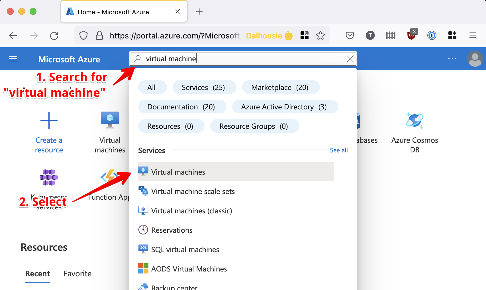

From the virtual machine resource page, click "Create".

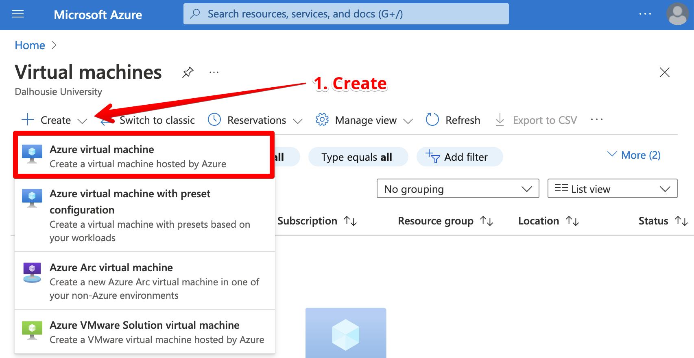

Now, you'll be prompted to configure the virtual machine.
There are some important properties you'll want to set:
* **Subscription**: Make sure "Azure for Students" is selected.
* **Resource group**: You can set this if you want. Resource groups are like folders for cloud resources, making it easier to track them or clean them up when you're done. You could make an "ECED 4406" resource group.
* **Virtual machine name**: Set this to something memorable (e.g. lab-0x001-vm)
* **Region**: On a student subscription, you'll have limited choice here. At the time of writing this, "West Europe" or "UK South" seem to have the best selection of VMs. If you pick a region that is geographically distant, you'll experience higher latency when connecting to the VM.
* **Image**: Choose Debian 11 "Bullseye" - Gen 2
* **Size**: Pick something in the "D" series with 2-4 vCPUs and 8-16GB of RAM (e.g. "D2as_v4").
* **Authentication type**: Choose "SSH public key".
* **SSH public key source**: Choose "Generate new key pair".
* **Inbound port rules**: Make sure "SSH (22)" is enabled.

You won't need to customize anything else.
Click "Review + create".
Take a look over your configuration to make sure everything looks correct.
If you're happy, click "Create".

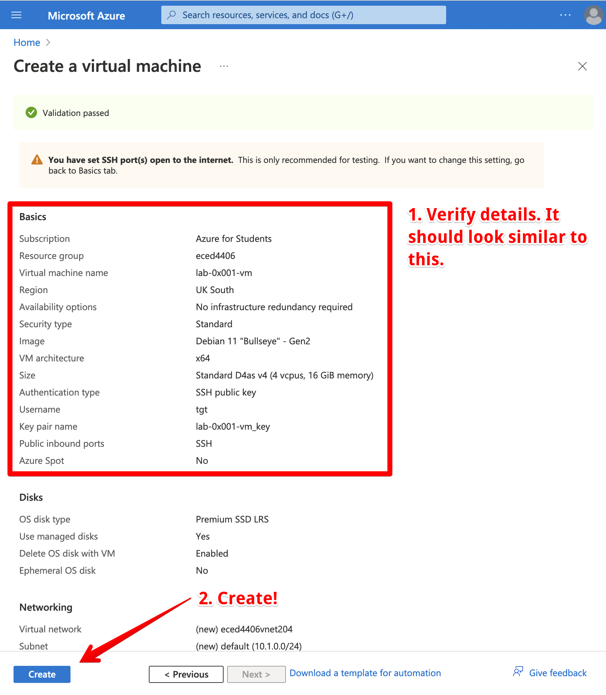

Make sure you download the private key so you can authenticate when SSHing into your VM!

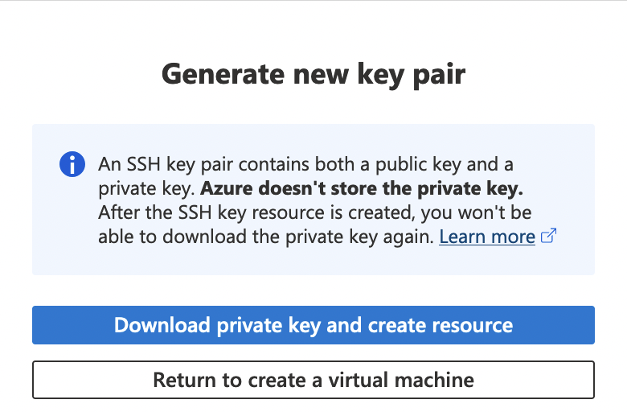

You'll need to wait for a few minutes for your virtual machine to be provisioned.

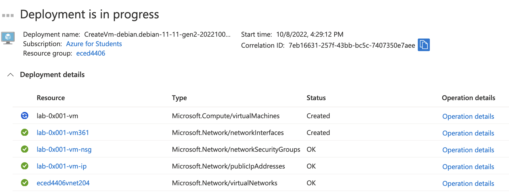

Once it's ready, click "Go to resource".

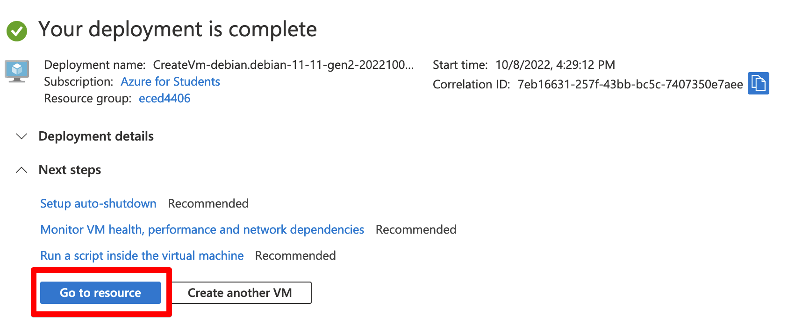

Take note of your VM's public IP address. You'll use this to establish an SSH connection.

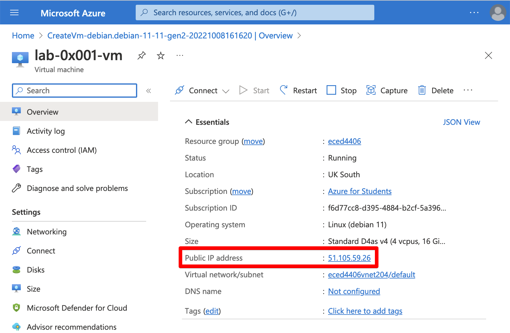

In a terminal on your local machine, connect to your VM with SSH.
If you are on MacOS or Linux, you may need to modify the permissions of your private key.

```
$ chmod 400 path/to/your/key.pem # on MacOS or Linux only
$ ssh -i path/to/your/key.pem YOUR_VM_USERNAME@YOUR_VM_IP
```

### Setup development environment

Once your VM is running and accessible over SSH, you can run the setup script (available [here](https://gist.githubusercontent.com/thomasgt/5e958016d49085b6532df25fffdb4c4d/raw/9adc16c9b7dfff54655f5b5e0a3089fc81a351e7/install-lab-0x001.sh)).

Before running any script you find on the internet, it is a good idea to manually inspect it to make sure it isn't doing anything nefarious. Here it is:
<script src="https://gist.github.com/thomasgt/5e958016d49085b6532df25fffdb4c4d.js"></script>

From the SSH shell for your virtual machine, run the following command:
```
$ curl https://gist.githubusercontent.com/thomasgt/5e958016d49085b6532df25fffdb4c4d/raw/9adc16c9b7dfff54655f5b5e0a3089fc81a351e7/install-lab-0x001.sh | bash
```

Once you have the necessary tools installed on the VM, you can set up Visual Studio Code on your local machine.

### Configure Visual Studio Code

VS Code can be used to develop on a remote machine.
First, install the "Remote - SSH" extension.

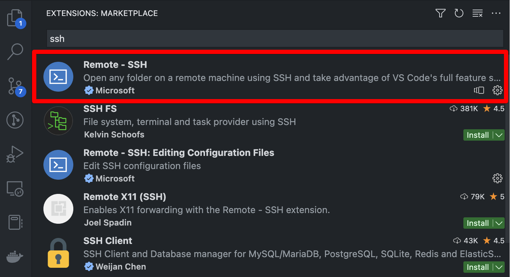

To create a remote connection, click the icon at the bottom left of the application.

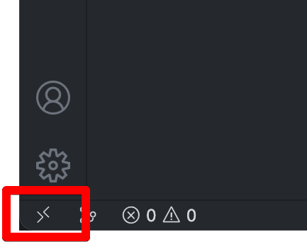

Click "Connect to host...".

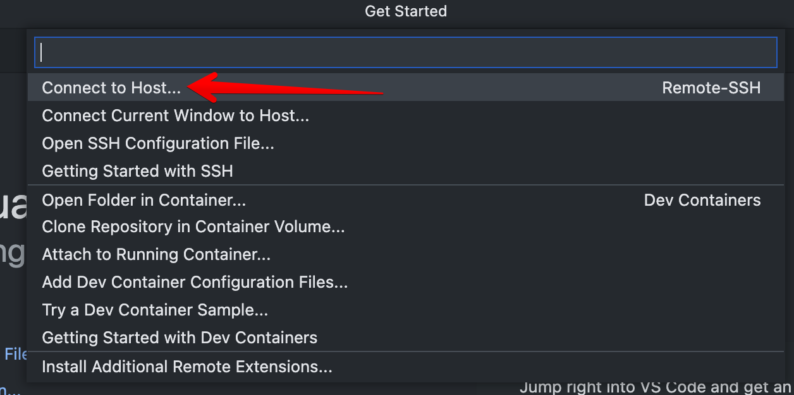

Click "Add New SSH Host...".

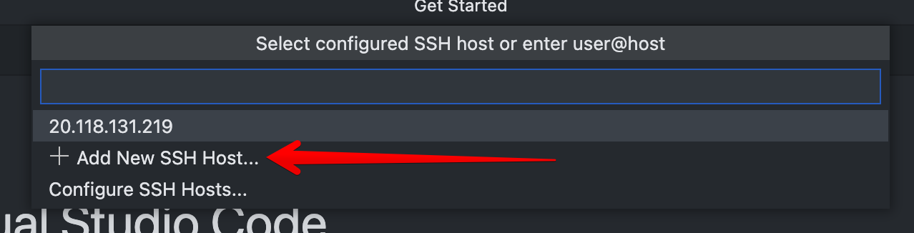

Enter the command you used to SSH into your VM when prompted.

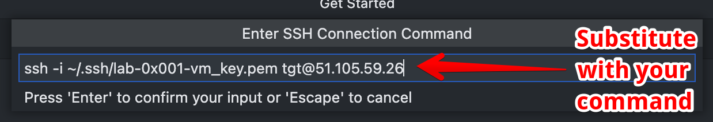

Complete the setup.
When VS Code is connected to another host, you should see the IP in the bottom left corner.

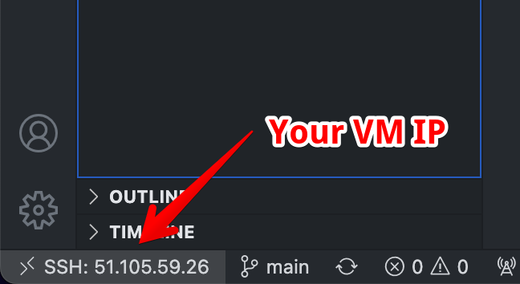

Once connected, open the `$HOME/qoi` folder on the remote machine from within VS Code.


Upon opening the `qoi` project, VS Code should prompt you to install the recommended extensions.
Proceed with the prompt, or manually install the "C/C++ Extension Pack".
Keep in mind that Visual Studio Code maintains separate sets of extensions for each host.
Just because you have the extensions installed on your local machine does not mean they'll be installed on your VM.

Copy and paste your solution from Assignment 0x000 into VS Code and run the benchmark to make sure everything works as you expect.
At this point, you should be ready to start analyzing and improving your code!

## Procedure

### Fuzzing

We'll start off with a bang by running the fuzzer against our decoders.
To enable fuzzing, select the "Linux Debug - Fuzzing" configuration and run "CMake: Delete cache and reconfigure" from the VS Code command palette.
Once CMake configuration completes, run "CMake: Build".

You should have an executable `qoi_info`.
This is a simple program that opens a QOI file and prints its metadata.
Try using this program to open some of the "bad" images in the `data/fuzzing` folder.

```
$ ./build-linux-debug-fuzzing/out/bin/qoi_info data/fuzzing/bad.0.qoi
```

Depending on the state of your decoder, you may see some problems.
The address or undefined behaviour sanitizer may warning you about different problems.

You can take this a step further by running the fuzzer.
This will generate a variety of random inputs based on the perturbing the sample files in specified folder.
**NOTE: I am running these commands from the root of my qoi project folder.
You may need to update your paths accordingly.**

```
$ ./build-linux-debug-fuzzing/out/bin/qoi_fuzz_test -rss_limit_mb=5000 data/fuzzing
```

NOTE: I set the `rss_limit_mb` to 5000MB, which is a bit larger than the maximum size of QOI image my decoder will decode.
If RSS is set too low, the fuzzer will give you lots of out of memory (OOM) errors, which aren't super interesting.
For more info on the fuzzing command line arguments, see [here](https://www.llvm.org/docs/LibFuzzer.html#options).
Feel free to experiment with some different options.

HINT: You probably want to set some kind of maximum output size limit in your decoder too!

At this point, you may have some problems to fix.
If the fuzzer found any problems, it should write the bad data to a file that you can inspect.
Take note of any of the problems you find and include them in your report.
Can you determine why the problem occurred?
You may want to open problem files with `qoi_info` in the debugger to spot the problem.

You may have to leave the fuzzer running for some time to spot an error.
Alternatively, you can switch to someone else's assignment to see if you spot any problems.
You may want to keep each of your group members' assignments on different branches so you can switch between them easily.
You may want to run the `qoi_info` program in the debugger to

So you have some problems to fix, but how do you know where to get started?
Turn on the static analyzers to spot possible errors in your code.

### Static Analysis
In terms of static analysis, we're going to keep things pretty simple.
We'll enable a number of compiler warnings and try to resolve them all.
We'll also run two static analysis tools: cppcheck and clang-tidy.

To enable these warnings and tools, select the "Linux Debug - Static Analysis".
Rebuild everything with "CMake: Delete cache and reconfigure" followed by "CMake: Clean rebuild".
Now you should see some additional warnings in the Output tab.
You can also see a summary of the issues in the Problems tab.
You may even see some yellow squiggles in the code itself.

Take note of the recommendations and try to fix them.
In your report, show how you fixed the different warnings.
You may find it useful to take screenshots of your code diffs.

Once you clean up all the warnings, re-run your decoder against the bad inputs and see if you fair any better.