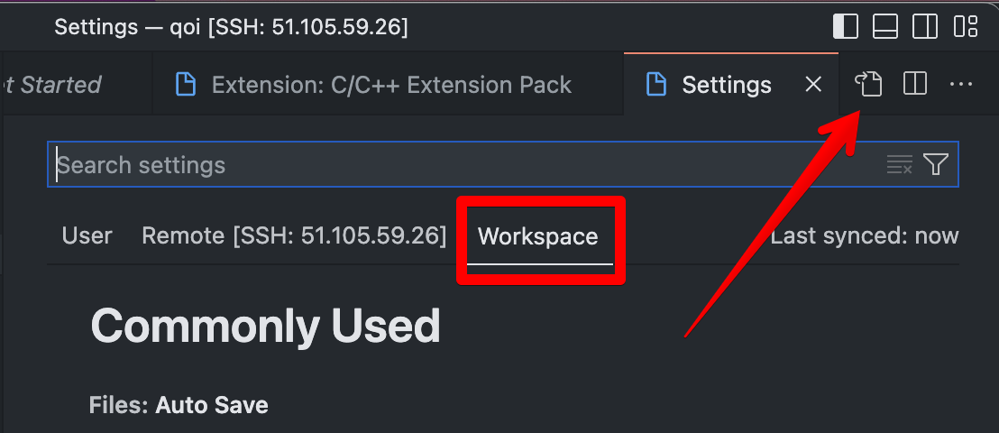

# 0x001 - Fuzzing

**Due at 11:59pm on TBD**

In this lab, you'll run static and dynamic analysis tools on your decoder from assignment 0x000 to find potential bugs and vulnerabilities.

## Setup

This lab involves setting up a cloud development environment in Azure.
Locally, all you'll need is Visual Studio Code and an SSH client.

### Create a virtual machine

The first step is to create a virtual machine in Azure.
First, sign up for Azure for Students with your Dalhousie email address [here](https://signup.azure.com/studentverification?offerType=1&correlationId=a0ea030f9d524626b261c17e4f500d7b).

Once you're signed up, navigate to the Azure portal [here](https://portal.azure.com).
For this lab, we just need to deploy a virtual machine.
Search for "virtual machine" in the top bar.


From the virtual machine resource page, click "Create".


Now, you'll be prompted to configure the virtual machine.
There are some important properties you'll want to set:
* **Subscription**: Make sure "Azure for Students" is selected.
* **Resource group**: You can set this if you want. Resource groups are like folders for cloud resources, making it easier to track them or clean them up when you're done. You could make an "ECED 4406" resource group.
* **Virtual machine name**: Set this to something memorable (e.g. lab-0x001-vm)
* **Region**: On a student subscription, you'll have limited choice here. At the time of writing this, "West Europe" or "UK South" seem to have the best selection of VMs. If you pick a region that is geographically distant, you'll experience higher latency when connecting to the VM.
* **Image**: Choose Debian 11 "Bullseye" - Gen 2
* **Size**: Pick something in the "D" series with 2-4 vCPUs and 8-16GB of RAM (e.g. "D2as_v4").
* **Authentication type**: Choose "SSH public key".
* **SSH public key source**: Choose "Generate new key pair".
* **Inbound port rules**: Make sure "SSH (22)" is enabled.

You won't need to customize anything else.
Click "Review + create".
Take a look over your configuration to make sure everything looks correct.
If you're happy, click "Create".


Make sure you download the private key so you can authenticate when SSHing into your VM!


You'll need to wait for a few minutes for your virtual machine to be provisioned.


Once it's ready, click "Go to resource".


Take note of your VM's public IP address. You'll use this to establish an SSH connection.


In a terminal on your local machine, connect to your VM with SSH.
If you are on MacOS or Linux, you may need to modify the permissions of your private key.

```
$ chmod 400 path/to/your/key.pem # on MacOS or Linux only
$ ssh -i path/to/your/key.pem YOUR_VM_USERNAME@YOUR_VM_IP
```

### Setup development environment

Once your VM is running and accessible over SSH, you can run the setup script (available [here](https://gist.githubusercontent.com/thomasgt/5e958016d49085b6532df25fffdb4c4d/raw/f514f760340ef692e6cc4c97192d91854a6fa6b5/install-lab-0x001.sh)).

Before running any script you find on the internet, it is a good idea to manually inspect it to make sure it isn't doing anything nefarious. Here it is:
<script src="https://gist.github.com/thomasgt/5e958016d49085b6532df25fffdb4c4d.js"></script>

From the SSH shell for your virtual machine, run the following command:
```
$ curl https://gist.githubusercontent.com/thomasgt/5e958016d49085b6532df25fffdb4c4d/raw/9278f4a2c3af841b3dcae507f73a5f37bbb63c16/install-lab-0x001.sh | bash
```

Once you have the necessary tools installed on the VM, you can set up Visual Studio Code on your local machine.

### Configure Visual Studio Code

VS Code can be used to develop on a remote machine.
First, install the "Remote - SSH" extension.


To create a remote connection, click the icon at the bottom left of the application.


Click "Connect to host...".


Click "Add New SSH Host...".


Enter the command you used to SSH into your VM when prompted.


Complete the setup.
When VS Code is connected to another host, you should see the IP in the bottom left corner.


Once connected, open the `$HOME/qoi` folder on the remote machine from within VS Code.


Upon opening the `qoi` project, VS Code should prompt you to install the recommended extensions.
Proceed with the prompt, or manually install the "C/C++ Extension Pack".
Keep in mind that Visual Studio Code maintains separate sets of extensions for each host.
Just because you have the extensions installed on your local machine does not mean they'll be installed on your VM.

Copy and paste your solution from Assignment 0x000 into VS Code and run the benchmark to make sure everything works as you expect.
At this point, you should be ready to start analyzing and improving your code!

## Procedure

In terms of static analysis, we're going to keep things pretty simple.
We'll enable a number of compiler warnings and try to resolve them all.

To turn on compiler warnings, you need to set the `ENABLE_WARNINGS` CMake option.
With the `qoi` project open remotely in VS Code, type `CONTROL/COMMAND` + `,` to open the settings.
Select the "Workspace" tab and open the JSON settings view from the top right corner.



Add the following snippet to turn on `ENABLE_WARNINGS`:
```

```
